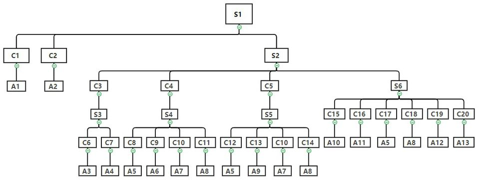
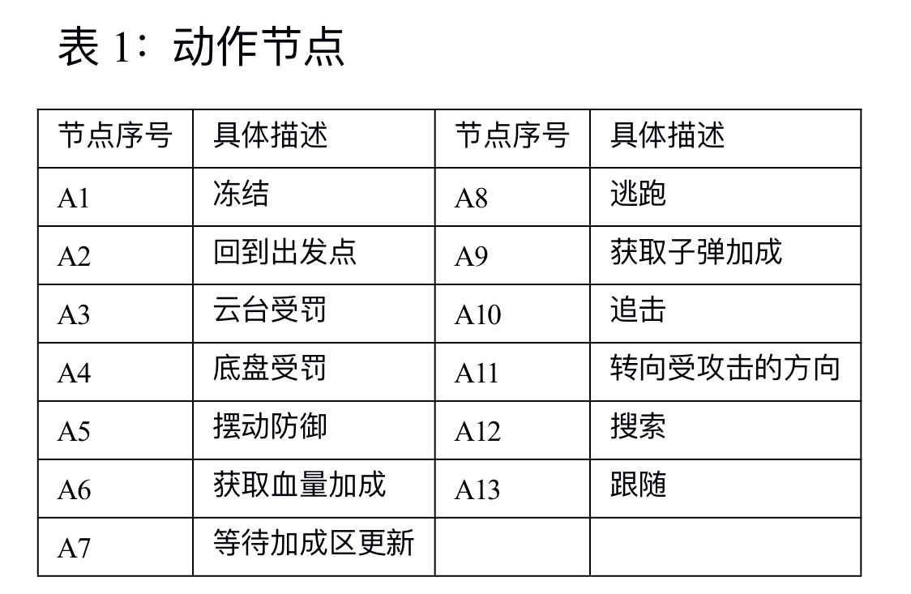
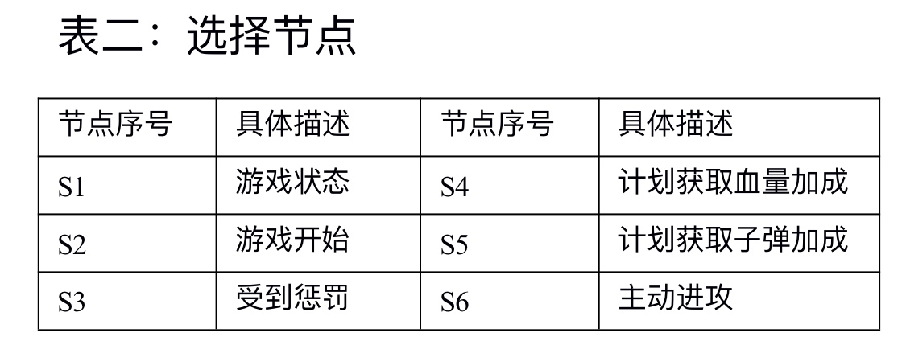
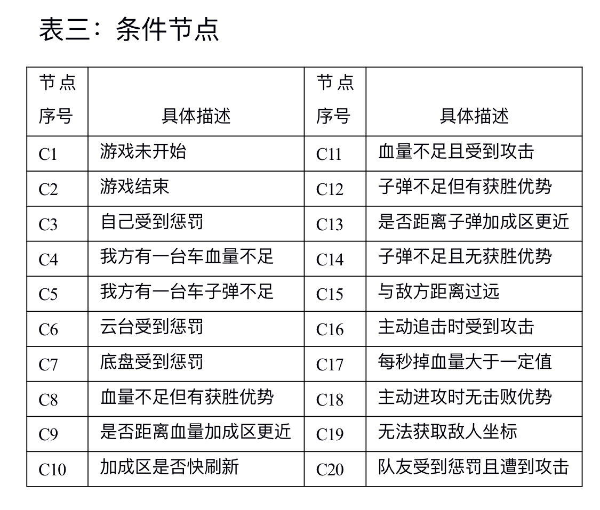

## 软件功能介绍
- 此部分
## 软件效果展示。需要体现整体项目的创新性和优势,结合可视化数据(例如视频网址,gif 图,测试图表等)对最终效果进行展示与定量分析

## 依赖工具、软硬件环境

- 硬件： 秒算
- 操作系统：Ubuntu-16.04
- ROS: ros-kinetic
- ProtoBuff-2.6
- Socket

## 编译、安装方式

使用ros提供的catkin_make进行全局编译，单独编译本功能包：catkin_make --pkg roborts_decision

## 文件目录结构及文件用途说明

### 目录结构说明

    ├── pictures
    │   ├── table1_2.jpg
    │   ├── table1.jpg
    │   ├── table2.jpg
    │   ├── table3.jpg
    │   └── tree.jpg
    ├── README.md
    ├── roborts_decision
    │   ├── action_node
    │   │   ├── BackAwayAction.h
    │   │   ├── BackBootArea.h
    │   │   ├── ChaseAction.h
    │   │   ├── ChassisLimited.h
    │   │   ├── DeckChaseAction.h
    │   │   ├── DefendAction.h
    │   │   ├── EscapeAction.h
    │   │   ├── FollowAction.h
    │   │   ├── FrozeAction.h
    │   │   ├── GainBloodAction.h
    │   │   ├── GainBulletAction.h
    │   │   ├── GimbalLimited.h
    │   │   ├── readme.md
    │   │   ├── SearchAction.h
    │   │   ├── TurnToDetectedDirection.h
    │   │   └── WaitBuffRefresh.h
    │   ├── behavior_test.cpp
    │   ├── blackboard
    │   │   ├── blackboard.h
    │   │   └── topic_name.h
    │   ├── CMakeLists.txt
    │   ├── config
    │   │   ├── buffposition.yaml
    │   │   ├── decision.prototxt
    │   │   ├── decision.yaml
    │   │   └── topic_name.prototxt
    │   ├── executor
    │   │   ├── chassis_executor.cpp
    │   │   ├── chassis_executor.h
    │   │   ├── gimbal_executor.cpp
    │   │   └── gimbal_executor.h
    │   ├── icra_decision_node.cpp
    │   ├── include
    │   │   ├── goal_factory.h
    │   │   └── redme.md
    │   ├── interact
    │   │   ├── mutualboard.h
    │   │   ├── pos_reciever.cpp
    │   │   └── readme.md
    │   └── package.xml
    └── roborts_msgs
        ├── action
        │   ├── ArmorDetection.action
        │   ├── GlobalPlanner.action
        │   └── LocalPlanner.action
        ├── CMakeLists.txt
        ├── msg
        │   ├── GimbalActionlib.msg
        │   ├── GimbalAngle.msg
        │   ├── GimbalControl.msg
        │   ├── GimbalRate.msg
        │   ├── ObstacleMsg.msg
        │   ├── PunishInfo.msg
        │   ├── PyArmorInfo.msg
        │   ├── referee_system
        │   │   ├── BonusStatus.msg
        │   │   ├── GameResult.msg
        │   │   ├── GameStatus.msg
        │   │   ├── GameSurvivor.msg
        │   │   ├── ProjectileSupply.msg
        │   │   ├── RobotBonus.msg
        │   │   ├── RobotDamage.msg
        │   │   ├── RobotHeat.msg
        │   │   ├── RobotShoot.msg
        │   │   ├── RobotStatus.msg
        │   │   └── SupplierStatus.msg
        │   ├── ResizedImage.msg
        │   ├── RobotInfo.msg
        │   ├── SentryInfo.msg
        │   ├── ShootInfo.msg
        │   ├── ShootState.msg
        │   ├── TreeStatus.msg
        │   └── TwistAccel.msg
        ├── package.xml
        └── srv
            ├── FricWhl.srv
            ├── GimbalMode.srv
            ├── ShootCmd.srv
            └── SwingDefend.srv

- [action_node](./roborts_decision/action_node/readme.md) 包含机器人可执行的各种动作行为, 包括一系列攻击行为、防御行为、加成和惩罚响应行为和准备行为  

- [blackboard](./roborts_decision/blackboard/readme.md)  黑板类，负责收集、处理和分发场上可获得的各种信息。包括： 各机器人的位置、各机器人自身的健康参数和场上各类决策时需要用到的参数等

- [interact](./roborts_decision/interact/readme.md)  负责两级交互的模快，使用套接字向双同伴机器人发送自身的相关信息并且与场外哨岗通信获取哨岗识别的结果  

- [include](./roborts_decision/include/readme.md) 包含行为树必需的头文件，这里主要放了goal_factory.h  

- [behavior_test.cpp](./roborts_decision/behavior_test.cpp)  这个文件是测试各行为运行情况的节点，通过它可以单独执行指定的节点，观察运行情况  

- [icra_decision_node.cpp](./roborts_decision/icra_decision_node.cpp) 决策节点，其中负责搭建好行为树并且将其运行起来，实施决策

## 软件与硬件的系统框图,数据流图

**行为树结构图：**
  

**动作节点介绍：**

**选择节点介绍：**

**条件节点介绍**

## 原理介绍与理论支持分析
## 软件架构或层级图--------------------------------------?
## ~~代码规范------~~
## 是否存在开源协议--------------------------------------？
## ~~函数、变量命名是否规范、统一------~~
## ~~关键功能函数、变量是否存在清晰的注释------~~
## 整体可编译可运行,容易测试,包含不同情况下的测试脚本或涵盖集成测试
## ~~是否遵循某种设计模式------~~
## ~~开源与分享,截止到评选日的开源影响力(star 数)------~~
